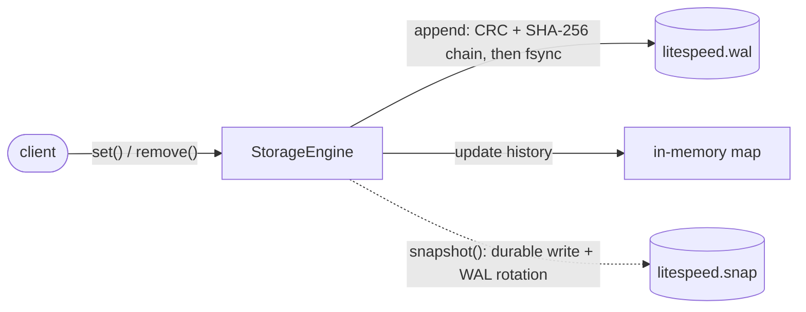
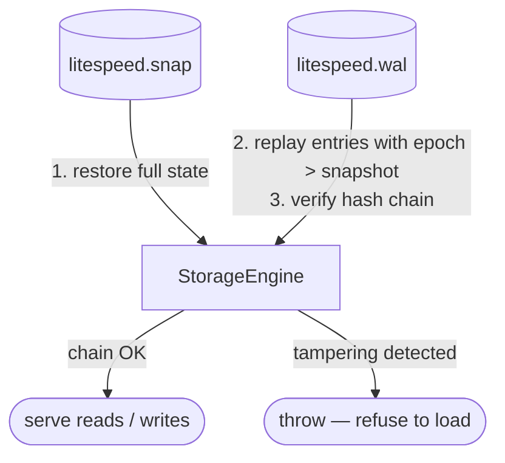
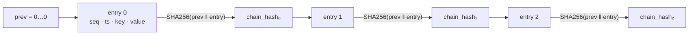

# LiteSpeedStore

A small, fast, crash-safe in-memory key-value store written in C++17, shaped as a **tamper-evident journal of events**. Each key holds an ordered history of values with timestamps and durations, backed by a Write-Ahead Log and periodic snapshots. The log is hash-chained, so any modification, reordering, or mid-log deletion is cryptographically detectable.

## What it demonstrates

- **Tamper-evident hash chain** — each WAL entry stores `chain_hash = SHA256(prev_hash ‖ entry)` plus a monotonic `seq`. Recovery verifies the chain and reports the exact offset of any in-place modification, reordering, or deletion; a tampered journal is refused rather than silently loaded. See [THREATMODEL.md](THREATMODEL.md).
- **Reader-writer concurrency** — `std::shared_mutex` allows unlimited concurrent reads; writes take an exclusive lock. Benchmarked to confirm the expected throughput ratio.
- **WAL persistence with CRC32** — every entry is checksummed; partial writes at the tail are detected and truncated on recovery, and distinguished from tampering.
- **Durable atomic snapshots** — `write → fsync(file) → rename → fsync(dir)`: the existing snapshot is never touched if a write fails, and a committed snapshot survives a power loss.
- **Portable on-disk format** — WAL and snapshot files carry a `magic + version` header and serialize all integers in explicit little-endian, so files are recognizable, versioned, and portable across architectures.
- **Group-commit** — `syncEveryN` parameter trades per-write durability for throughput; benchmarked to show the trade-off.
- **Cache-friendly storage** — history stored as `vector<Record>` (value types) rather than `vector<unique_ptr<Record>>` to avoid per-entry heap allocation and improve iteration locality.
- **RAII profiling** — `TRACE_SCOPE` macro records elapsed time directly into the store without touching production data paths.
- **Fuzz testing** — libFuzzer harnesses feed random bytes into both the WAL and snapshot parsers under AddressSanitizer + UBSan; run in CI on every push.
- **CI pipeline** — GitHub Actions: Debug build, AddressSanitizer, ThreadSanitizer, libFuzzer, and Doxygen → GitHub Pages.

## Architecture

A write goes to the WAL (durably) and to the in-memory history; a snapshot
periodically folds the state to disk and rotates the log.



On startup the state is rebuilt from the snapshot, then the WAL is replayed —
verifying the hash chain. A torn tail from a crash is truncated; tampering is refused.



## Demo — tamper evidence in action

`litespeed-demo` records a few endpoint events, verifies the chain, flips a
single byte, then re-verifies — the change is caught at the exact offset:


<details>
<summary>Sample output (text)</summary>

```text
LiteSpeedStore - tamper-evidence demo
=====================================

[agent]    recorded 3 events to /tmp/litespeed_demo.wal
[agent]    checkpoint to anchor remotely:  seq=3  head=d04cb4dfd191108f...

[verify]   chain intact — 3 entries verified  [OK]

[attacker] flipped 1 byte at offset 66 (inside event #0's recorded data)

[verify]   TAMPERING DETECTED at offset 16 (after 0 valid entries)  [FAIL]
```
</details>

The GIF is reproducible with [`vhs`](https://github.com/charmbracelet/vhs): `vhs assets/demo.tape`.

`litespeed-verify <wal>` runs the same read-only check as a standalone tool
(exit code `0` = intact, `1` = tampering, `2` = error) — the kind an agent runs
against its journal, or a remote service against an uploaded copy.

```bash
cmake -B build -DCMAKE_BUILD_TYPE=Release && cmake --build build --target litespeed-demo litespeed-verify
./build/litespeed-demo
```

## Building

```bash
# Standard build
cmake -B build -DCMAKE_BUILD_TYPE=Release
cmake --build build --parallel

# AddressSanitizer + UBSan
cmake -B build -DCMAKE_BUILD_TYPE=Debug -DSANITIZE_ADDRESS=ON
cmake --build build --parallel

# ThreadSanitizer
cmake -B build -DCMAKE_BUILD_TYPE=Debug -DSANITIZE_THREAD=ON
cmake --build build --parallel

# libFuzzer (requires clang)
cmake -B build_fuzz -DCMAKE_BUILD_TYPE=Release -DFUZZ=ON -DCMAKE_CXX_COMPILER=clang++
cmake --build build_fuzz --target FuzzWAL FuzzSnapshot -j4
./build_fuzz/FuzzWAL fuzz/corpus -max_total_time=60 -max_len=512
```

## Persistence Layer

The engine implements a durable, crash-safe persistence layer using a Write-Ahead Log (WAL), a snapshot file, and CRC-based integrity checks.

### `litespeed.wal` Layout

The file starts with a fixed 16-byte header, followed by a sequence of entries.
All multi-byte integers are little-endian.

```
+----------------+----------------+------------------------------------------+
| Header field   | Size (bytes)   | Description                              |
+----------------+----------------+------------------------------------------+
| MAGIC          | 4              | "WSL1" (0x314C5357) — file identifier    |
| VERSION        | 4              | Format version (currently 2)             |
| FLAGS          | 8              | Reserved (0); future use, e.g. crypto    |
+----------------+----------------+------------------------------------------+
```

Each entry that follows the header. `CHAIN_HASH = SHA256(prev_hash ‖ SEQ..VALUE)`,
where `prev_hash` is the previous entry's hash (all-zero for the first entry):

```
+----------------+----------------+------------------------------------------+
| Field          | Size (bytes)   | Description                              |
+----------------+----------------+------------------------------------------+
| CRC32          | 4              | Checksum of the entire entry (after CRC) |
| SEQ            | 8              | Monotonic sequence number (gap = tamper) |
| TIMESTAMP_LOW  | 4              | Epoch nanoseconds (low 32 bits)          |
| TIMESTAMP_HIGH | 4              | Epoch nanoseconds (high 32 bits)         |
| EPOCH          | 8              | Snapshot generation for the entry        |
| KEY_LEN        | 4              | Length of the key string                 |
| VALUE_LEN      | 4              | Length of the serialized value blob      |
| TYPE           | 1              | 1 = PUT, 2 = DELETE                      |
| KEY            | KEY_LEN        | The raw key data                         |
| VALUE          | VALUE_LEN      | Serialized [Duration(8) + Value(N)]      |
| CHAIN_HASH     | 32             | SHA-256 linking this entry to the chain  |
+----------------+----------------+------------------------------------------+
```

#### Hash chain — tamper evidence

Each entry's `CHAIN_HASH` folds in the previous entry's hash, so every record is
bound to all records before it. Modifying, reordering, or deleting any entry
breaks every hash downstream, and recovery reports the exact offset.



See [THREATMODEL.md](THREATMODEL.md) for the guarantees and their limits.

### `litespeed.snap` Layout

The snapshot stores the full in-memory state, including history for each key, so `getAverage()` and `historyCount()` stay correct after recovery.

```text
magic + version + crc32
snapshot_epoch
key_count
  key_len + key
  record_count
    timestamp + duration + value_len + value
```

### Recovery Order

1. Load `litespeed.snap` if it exists.
2. Restore the full in-memory state from the snapshot.
3. Replay only WAL entries with an epoch greater than the snapshot epoch.
4. If the WAL was compacted, replay is small and startup is faster.

### Snapshot / Compaction

- `StorageEngine::snapshot()` writes a durable snapshot of the current in-memory state.
- After the snapshot is committed, the WAL epoch is advanced and the log is truncated for rotation.
- If the truncation step fails, the snapshot is still valid and recovery still works because old WAL entries are ignored by epoch.

### Running the Tests

```bash
cmake -B build -DCMAKE_BUILD_TYPE=Debug
cmake --build build --parallel
ctest --test-dir build --output-on-failure
```

### Fuzz Testing

Both on-disk parsers are hardened with libFuzzer harnesses under AddressSanitizer + UBSan — any crash, over-read, or over-allocation fails the run:

- `fuzz/fuzz_wal.cpp` feeds random bytes through `WAL::recover()`.
- `fuzz/fuzz_snapshot.cpp` wraps the input in a valid header (matching CRC) so it reaches `Snapshot::load()`'s length-driven parsing.

```bash
cmake -B build_fuzz -DCMAKE_BUILD_TYPE=Release -DFUZZ=ON -DCMAKE_CXX_COMPILER=clang++
cmake --build build_fuzz --target FuzzWAL FuzzSnapshot -j4
./build_fuzz/FuzzWAL      fuzz/corpus          -max_total_time=60 -max_len=512
./build_fuzz/FuzzSnapshot fuzz/corpus_snapshot -max_total_time=60 -max_len=512
```

CI runs both for 30 seconds on every push (see `.github/workflows/ci.yml`, job `fuzz`).

## Benchmarks

Hand-rolled timing benchmark using `StorageEngine::makeInMemory()` (no WAL, no fsync).  
Build: `cmake -B build -DCMAKE_BUILD_TYPE=Release && cmake --build build --target Benchmark`  
Run: `./build/Benchmark`

| Scenario | Ops | Time | Throughput |
|---|---|---|---|
| `set()` single-thread | 500 000 | 47.4 ms | **10 540 235 ops/s** |
| `get()` single-thread | 500 000 | 8.5 ms | **58 859 108 ops/s** |
| `getAverage()` single-thread (100-entry history) | 500 000 | 32.1 ms | **15 571 353 ops/s** |
| Mixed 4 writers + 4 readers (concurrent) | 1 600 000 | 432.2 ms | **3 702 288 ops/s** |

*Measured on Linux x86-64, Release build (`-O3`), in-memory store. History stored as `vector<Record>` (value types) for cache-friendly iteration.*

**Key observations:**

- `get()` is **5.6× faster** than `set()` — `shared_mutex` correctly allows concurrent reads while serialising only writes.
- Switching from `vector<unique_ptr<Record>>` to `vector<Record>` improved `getAverage()` by **+15.6%** and concurrent throughput by **+57.2%** — eliminating per-record heap allocations and improving cache locality during history iteration.
- Concurrent throughput drops vs. single-thread because 4 writers each acquire a `unique_lock`, blocking all readers. This is the expected cost of write-heavy workloads; a read-heavy workload would scale much better.

### WAL-backed: group-commit trade-off

`StorageEngine` accepts a `syncEveryN` parameter controlling how often `fsync()` is called. `syncEveryN=1` is the default — every write is durable. Higher values batch writes, trading durability for throughput.

| Scenario | Ops | Time | Throughput |
|---|---|---|---|
| WAL `set()` syncEveryN=1 (max durability) | 276 281 | 500 ms | **552 561 ops/s** |
| WAL `set()` syncEveryN=16 | 291 549 | 500 ms | **583 096 ops/s** |
| WAL `set()` syncEveryN=64 | 307 350 | 500 ms | **614 700 ops/s** |

*Measured on NVMe SSD; on HDD the gap is much larger (~100–200 ops/s at syncEveryN=1).*

`syncEveryN=1` guarantees each write survives a crash. `syncEveryN=N` risks losing the last N−1 writes on power failure — a deliberate durability trade-off, not a bug.

The per-entry SHA-256 hash chain is cheap relative to `fsync`: at `syncEveryN=1` the durable path is fsync-bound, so tamper-evidence costs almost nothing; batching (higher `syncEveryN`) amortizes the fsync and lets throughput rise, with the hashing only a small fraction of per-write cost. (The in-memory figures above take no WAL path and are unaffected.)

## API Documentation

All public headers are documented with Doxygen. CI generates and deploys the docs to GitHub Pages on every push to `main`.

To generate locally:

```bash
doxygen Doxyfile
open docs/html/index.html
```
